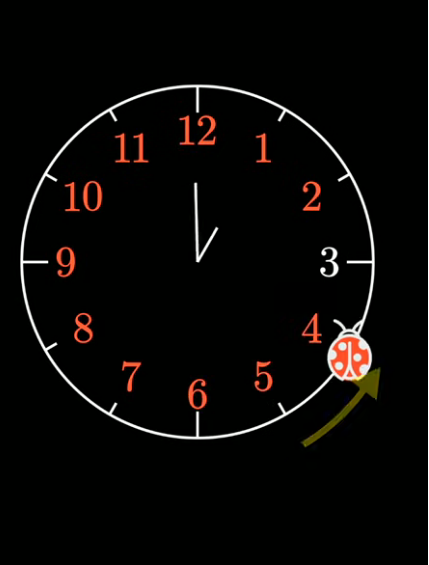

# Random Walk Simulation in Rust

<center>



</center>

## Overview

This Rust project simulates a **random walk on a cycle of 12 states** to investigate the distribution of the *last unvisited* node when the walk visits 11 out of 12 nodes. We explore how different stopping conditions and concurrency (parallelism) affect statistical outcomes and performance.


## 📌 Motivation

You may find this problem interesting if you enjoy **probability, random processes, and algorithms**. It is inspired by ideas from combinatorics and random walks that show up in puzzles like the one featured in this YouTube Shorts video:

👉 *The [ladybug clock puzzle](https://www.youtube.com/shorts/t3jZ2xGOvYg) (first in a set of monthly puzzles)* — a short video illustrating a mathematical puzzle about movement around a circle from 3Blue1Brown.

Although that particular video focuses on a puzzle rather than a simulation, it provides a good conceptual backdrop for why random walks on cycles can lead to unintuitive outcomes.


## 🧠 What the Simulation Does

- Starts at position `0` on a cycle of size `12`.
- At each step, randomly moves +1 or -1 (with wrap‑around).
- Tracks visited states until **only one state remains unvisited**.
- Records which state was unvisited when the process stopped.
- Repeats this many times to estimate empirical percentages.

By comparing simulation results with theoretical intuition, you’ll see how **initial conditions and stopping rules influence probability distributions**.

## ⚙️ Getting Started

### Requirements

- Rust (latest stable toolchain)
- Cargo package manager

---

## 🚀 Running the Simulation

1. Clone the repository:
   ```bash
   git clone https://github.com/your-username/random-walk-rust.git
   cd random-walk-rust
   ```

2. Run the serial version:
   ```bash
   cargo run --release
   ```
---

## 📊 Output

The program prints **percentages for each last-unvisited node** (excluding `12`, which cannot be last because it is the starting location).

After running 5 million iterations, we get the follow results

| Number | Percentage Time it is the Last Number |
| :----: | :-----------------------------------: |
 1 |  9.098%
 2 |  9.100%
 3 |  9.083%
 4 |  9.103%
 5 |  9.101%
 6 |  9.075%
 7 |  9.100%
 8 |  9.095%
 9 |  9.099%
10 |  9.085%
11 |  9.062%


So, overall, we see that each number of the clock face is equally likely to the the last unvisited number for a cyclical random walk. This is perhaps slightly counterintuitive given 6 is further way from the initial starting point of 12. However, it appears that all values are equally likely, with a probability of $\frac{1}{11}$.

## 🧩 Why It Matters

This project highlights a few important ideas:

- 🚶‍♂️ **Random walk behaviour** on cycles
- ⏱ **Stopping rules** and their impact on outcomes
- ⚙️ **Parallel computation** for faster Monte Carlo simulations

It is ideal as a **teaching example for probability, simulation, and Rust concurrency patterns**.


## 📦 Dependencies

- `rand` — for random number generation
- `rayon` — for easy data-parallel iteration

Install via `Cargo.toml`; see the code examples in this repository for usage.


## 📜 License

This project is available under the MIT License.
